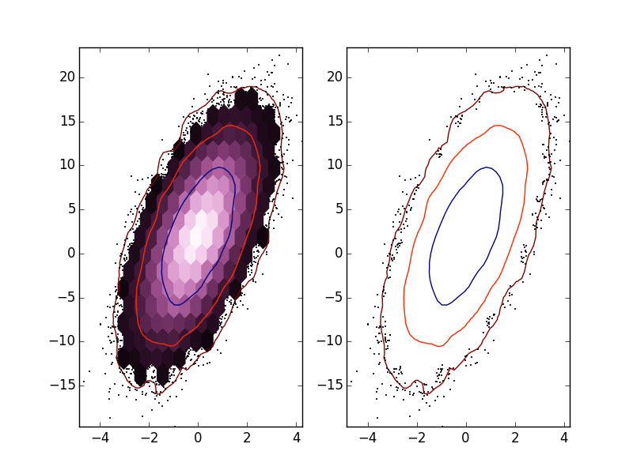

[](http://dx.doi.org/10.5281/zenodo.13361)


densityplot
===========

matplotlib funcitons used to visualize desnity plots made up of
scatter points.

#Install
```
python setup.py build
python setup.py install
```

##Dependencies
+ Numpy (1.9.0 or higher)
+ Scipy (0.14.0 or higher)
+ Matplotlib (1.4.0 or higher)

#New cubehelix colormaps
```python
from densityplot import *
from pylab import *

new_colormap = cm.cubehelix_purple
new_colormap_reverse = cm.cubehelix_purple_r
```

###Full list of new colormaps


#density-scatter plot

```python
from densityplot import *
import pylab as pl
pl.np.random.seed(0)
n = 100000
x = pl.np.random.standard_normal(n)
y = 2 + 3 * x + 4 * pl.np.random.standard_normal(n)

pl.figure(1)
pl.subplot(121)
hex_scatter(x, y, min_cnt=20, levels=3, std=True, smoothing=1,
            hkwargs={'gridsize': 20, 'cmap': pl.cm.cubehelix_purple_r}, 
            skwargs={'color': 'k'})
pl.subplot(122)
hex_contour(x, y, min_cnt=15, levels=3, std=True, smoothing=1,
            hkwargs={'gridsize': 20}, 
            skwargs={'color': 'k'})
```

#hexbin subtract
####data set 1

####data set 2

####difference image

```python
from densityplot import *
import pylab as pl
import numpy as np
n=100000
x1=np.random.standard_normal(n) #random x points
y1=2+3*x1+4*np.random.standard_normal(n) #random y points
    
x2=np.random.standard_normal(n) #random x points
y2=2-3*x2+4*np.random.standard_normal(n) #random y points
    
hex_difference((x1,y1),(x2,y2),show_all=True,color_bar=True,
               hkwargs={'gridsize':100,
                 'extent':[-4.5,4.5,-25,25],
                 'vmin':-180,'vmax':180})
pl.show()
```

#custom divergent colormaps

```python
from densityplot import *
from pylab import *
 
#create some data to plot
x = arange(0, pi, 0.1)
y = arange(0, 2*pi, 0.1)
X, Y = meshgrid(x,y)
Z = cos(X) * sin(Y) * 10
    
#stitch together two colorbars
#(the second colorbar is automatically reversed)
dub_cm=mk_dub_color('cubehelix_purple','cubehelix_green')
#set the normalization such that the split is at zero
n=MidNorm(vmax=10,vmin=-5)

#use this colorbar and normiazation to plot the image
imshow(Z, interpolation='nearest', cmap=dub_cm, 
       norm=n, vmax=10, vmin=-15)
colorbar()
show()
```

#ND ellipsoid projection

```python
from densityplot import *
from pylab import * 
N=10000 
Data=np.random.multivariate_normal([2.,-2.,0.],
    [[1,.25,-.5],[.25,.1,.6],[-.5,.6,5]],size=N)
E=Ellipse_proj(Data)
#get the list of points inside the 
#1 and 2 sigma confidence intervals
inside=E.inside([0.68,.955]) 
#check that the correct fraction is being found
print 'percent inside: ',inside[:,0].sum()/float(N),inside[:,1].sum()/float(N) 


#plot all 1d and 2d projections of the data
#with the 1 and 2 sigma confidence intervals
ax1=subplot(3,3,1)
a,b,c=ax1.hist(Data.T[0],25,normed=True,histtype='step') #make a histogram
mu,sig=E.one_d_ellipse(array([1,0,0]),[0.68,.955]) #get the mean and sigma points
ax1.vlines([mu,mu+sig[0],mu-sig[0],mu+sig[1],mu-sig[1]],0,a.max()) #plot the mean and confidence intervals as virtical lines

ax2=subplot(3,3,4)
ax2.plot(Data.T[0],Data.T[1],',') #plot 2d projection
el=E.two_d_ellipse(array([1,1,0]),[0.68,.955],alpha=0.6,zorder=30) #get the matplotlib Ellipse objects for the 1 and 2 sigma levels
el[1].set_facecolor('#ff0000') #change one ellipse color to red
ax2.add_artist(el[1]) #add the object to the plot
ax2.add_artist(el[0])

ax3=subplot(3,3,5)
a,b,c=ax3.hist(Data.T[1],25,normed=True,histtype='step')
mu,sig=E.one_d_ellipse(array([0,1,0]),[0.68,.955])
ax3.vlines([mu,mu+sig[0],mu-sig[0],mu+sig[1],mu-sig[1]],0,a.max())

ax4=subplot(3,3,7)
ax4.plot(Data.T[0],Data.T[2],',') #plot the data
el=E.two_d_ellipse(array([1,0,1]),[0.68,0.955],alpha=0.6,zorder=30)
el[1].set_facecolor('#ff0000')
ax4.add_artist(el[1])
ax4.add_artist(el[0])

ax5=subplot(3,3,8)
ax5.plot(Data.T[1],Data.T[2],',') #plot the data
el=E.two_d_ellipse(array([0,1,1]),[0.68,0.955],alpha=0.6,zorder=30)
el[1].set_facecolor('#ff0000')
ax5.add_artist(el[1])
ax5.add_artist(el[0])

ax6=subplot(3,3,9)
a,b,c=ax6.hist(Data.T[2],25,normed=True,histtype='step')
mu,sig=E.one_d_ellipse(array([0,0,1]),[0.68,0.955])
ax6.vlines([mu,mu+sig[0],mu-sig[0],mu+sig[1],mu-sig[1]],0,a.max())

show()
```
